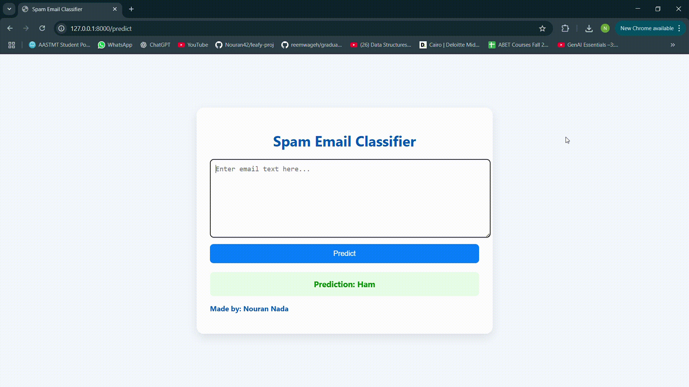

# Spam Email Classifier – FastAPI + DistilBERT
A web-based spam detection system built with FastAPI and a fine-tuned DistilBERT model. This project classifies input email text as Spam or Ham (Not Spam) in real time through a clean, responsive interface.

# DEMO


# Features
- **Real-time Spam Classification** – instantly detects spam messages from user input.
- **State-of-the-art NLP** – uses a fine-tuned DistilBERT transformer model.
- **FastAPI Backend**– high-performance, asynchronous Python API.
- **Responsive UI** – clean HTML/CSS with dynamic result display.
- **GPU Support** – automatically uses CUDA if available.
- **Extensible** – easily replace or upgrade the underlying model.

 # Teck Stack
 
 | Component      | Technology Used                                         |
| -------------- | ------------------------------------------------------- |
| **Backend**    | FastAPI                                                 |
| **Frontend**   | HTML + CSS (Jinja2 Templates)                           |
| **Model**      | DistilBERT (HuggingFace Transformers)                   |
| **Framework**  | PyTorch                                                 |
| **Deployment** | Local/Cloud (e.g., Render, Railway, HuggingFace Spaces) |


# Project Structure
```text 
├── app.py                  # FastAPI application
├── templates/
│   └── index.html          # Frontend template
├── spam-classifier-model/  # Model directory (ignored in Git)
├── requirements.txt        # Python dependencies
└── README.md               # Project documentation

```

# Installation and Usage
## clone the repo
git clone https://github.com/YourUsername/Spam_Detection_Project.git
cd Spam_Detection_Project


## Install Dependencies
pip install -r requirements.txt


## Download and place Folder 
Run the Juypyter notebook. Place your fine-tuned DistilBERT model files in the spam-classifier-model/ directory.
(The pytorch_model.bin file is large and is ignored in .gitignore.)

## Run the app

uvicorn app:app --reload

# Author
Nouran Nada – Machine Learning & AI Enthusiast
